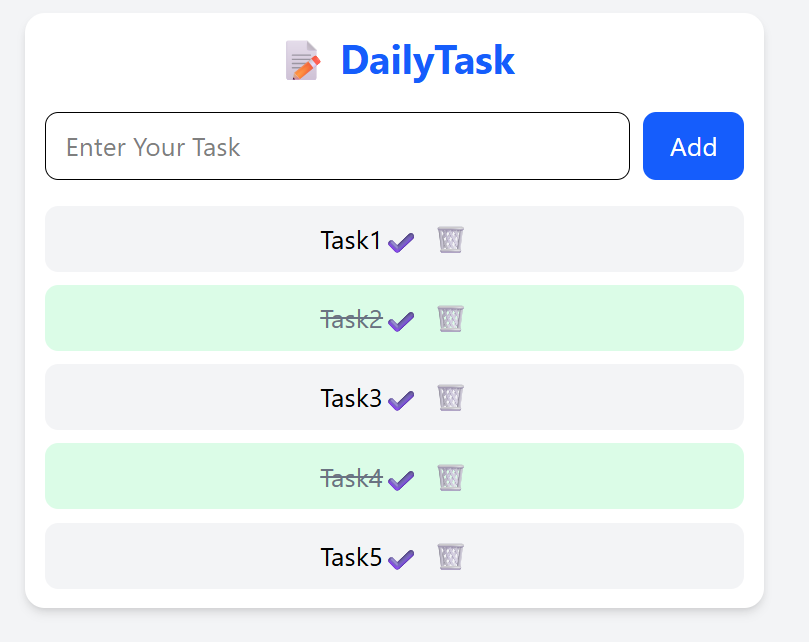

# 📝 DailyTask - React Todo App

A simple Todo List application built with React and Tailwind CSS.  
This app allows users to add, mark complete, and delete tasks with persistent storage using `localStorage`.



---

## Features

- Add new tasks
- Mark tasks as completed or incomplete
- Delete tasks
- Tasks are saved in browser localStorage and persist on page reload
- Responsive and clean UI styled with Tailwind CSS

---

## Technologies Used

- React (Functional Components and Hooks)
- Tailwind CSS
- Browser localStorage for data persistence

---

## Getting Started

### Prerequisites

- Node.js and npm installed on your machine

### Installation

1. Clone the repository:

```bash
git clone https://github.com/your-username/dailytask.git
```

2. Navigate to the project folder:

```bash
cd dailytask
```

3. Install dependencies:

```bash
npm i
```

4. Start Dev Server
```bash
npm dev run
```

5. Go To `http://localhost:5173/`

---

## Usage

- Type your task into the input field
 
- Press Enter or click the Add button to add the task
 
- Click the ✔️ button to toggle task completion
 
- Click the 🗑️ button to delete the task
 
- Tasks will remain saved even after page reload
