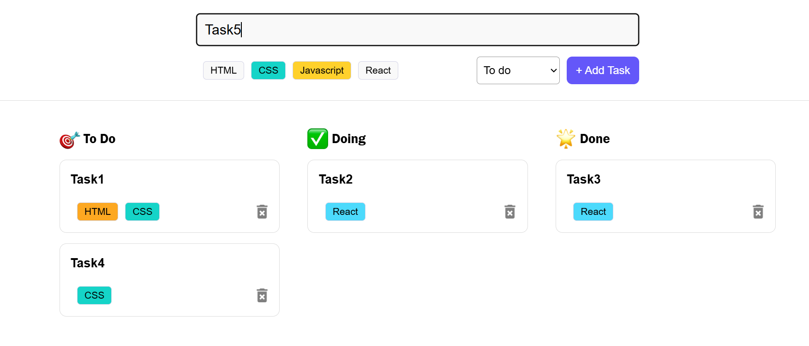

# Modern ToDo App

A clean and simple **Todo List App** built using **React**, designed to help you keep track of your daily tasks with ease.

---

## 🚀 Features

- ✅ Add, edit, and delete tasks
- 🎯 Mark tasks as `todo/doing/done`
- 🏷️ Tag system for filtering tasks (`HTML`, `CSS`, `JavaScript`, `React`)
- 📦 Persistent data using `localStorage`
- 🎨 Responsive and minimal UI with custom styling

---

## 🧪 Tech Stack

- ⚛️ React (Functional components + Hooks)
- 🧠 useState, useEffect for state and side effects
- 🖌️ Custom CSS for styling
- 🗃️ localStorage for persistent task storage
